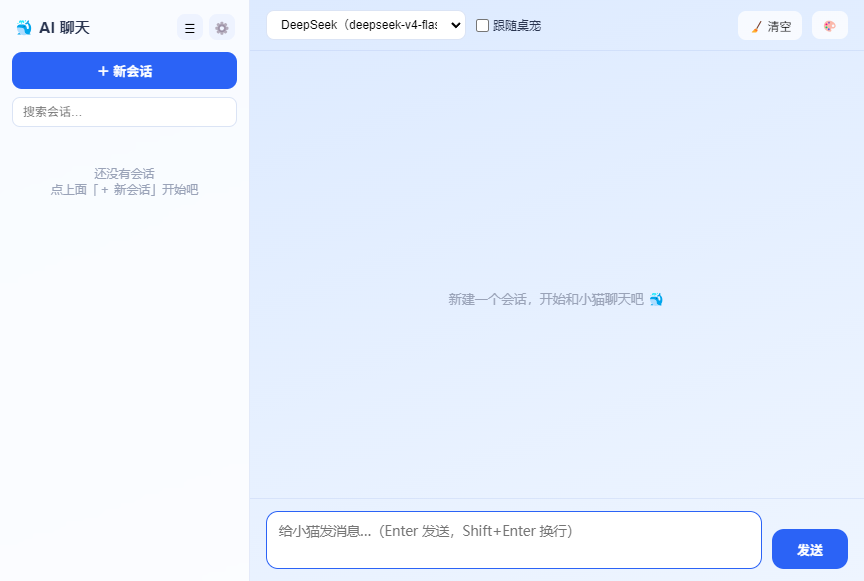

# DeepSeek Pet 🐱

一只住在你桌面右下角的猫耳少女：帮你实时盯着 DeepSeek API 余额、在低价时段提醒你「跑任务最划算」，
还能跟你 AI 聊天、看看你的屏幕、和 Claude/ZCode 等 Agent 联动干活。

> 基于 Electron 构建的 Windows 桌面桌宠。透明无边框、常驻托盘、可拖动互动、多开碰撞、热加载角色。

## ✨ 功能列表

### DeepSeek 余额管家

- **余额实时监控**：按设定间隔自动查询 DeepSeek API 余额，支持 V4 Flash / V4 Pro 两种模型。
- **低价时段提醒**：识别 DeepSeek 计费时段（工作日北京时间 09:00–12:00、14:00–18:00 为高价，其余半价），时段切换时主动气泡提醒。
- **余额变动提醒**：余额变化超过阈值时弹气泡告知；余额不足阈值时告警。
- **余额分档心情**：按余额分 6 档（欠费 → 鲸鱼大户），跨档时切换姿势 + 专属台词（对标 dsh-pet）。
- **余额缓存 / 隐藏省电**：30 秒内重复查询走缓存；窗口隐藏时暂停刷新与空闲行为。

### 桌宠本体

- **可爱互动**：按下压扁、点击抚摸冒爱心、随机台词；眨眼、发呆、拉伸、转身等空闲小动作。
- **拖拽玩法**：抓起有姿态、朝向随手翻转；松手惯性抛掷撞边反弹；拖拽中按住右键可「弹弓蓄力」×2.6 倍发射。
- **自主游走**：空闲时自己在屏幕上散步，到达后东张西望；任意交互立即打断。
- **生活状态引擎**：自动融合时段/余额/深夜/任务四个信号——低价时段爱打滚卖萌、高价和深夜趴桌打盹、
  余额告急蔫头耷脑，并周期性自动举牌播报当前处境（「低价！」牌 /「快充值！」牌）；开工时切工作姿势。
- **状态机（FSM）驱动**：14 态有限状态机（基础/互动/功能/系统/终态五级优先级）统一指挥立绘、
  气泡、游走与帧动画——高优先级事件（警报/完成）立即打断当前动作，临时动作播完自动回退；
  支持雪碧图/序列帧动画清单热加载。架构详见 [docs/FSM.md](docs/FSM.md)。
- **工作状态 HUD**：头顶玻璃气泡显示当前任务（思考/生成/完成/错误）与进度、耗时。
- **迷你模式**：收起为一条迷你悬浮条，不挡工作区。
- **桌面体感**：鼠标穿透（空区点到下层窗口）、锁定位置（Shift 仍可拖）、不透明度 10–100%。
- **动画倍速**：循环动画播放倍速 1.0–2.0x（对标 dsh-pet）。
- **闲置降帧**：30 秒无交互后呼吸动画减速省电，任意交互恢复。

### AI 能力

- **AI 聊天工作台**：独立聊天窗，多会话管理（置顶/重命名/搜索/批量删除）、SSE 流式输出、
  自定义 System Prompt、多 Provider（任意 OpenAI 兼容服务）、跟随桌宠移动、四套主题（对标 dsh-pet Chat 版）。
- **快速对话气泡**：不打开聊天窗也能问——桌宠头顶的迷你输入框，回答流式写回台词气泡。
- **看看屏幕**：截屏 + 前台窗口上下文发给视觉模型，桌宠告诉你它看到了什么（截图仅内存处理，不落盘）。
- **主动识屏陪伴**：前台切到白名单应用时，桌宠主动冒泡关怀（默认关闭，白名单支持 `*` 通配）。
- **Agent 联动**：本机 HTTP 事件服务（127.0.0.1:27890），Claude hooks / ZCode / 任意脚本都能把
  任务进度、台词、心情推给桌宠。协议见 [docs/AGENT_PROTOCOL.md](docs/AGENT_PROTOCOL.md)，
  CLI 发送器 `tools/agent-event.mjs`，Claude hooks 示例见 [integrations/](integrations/claude-hooks.example.json)。

### 扩展玩法

- **姿势素材集**：8 张基础立绘之外，附带由现有立绘程序化派生的姿势——低价「举牌」、余额告急「快充值」举牌、
  趴下休息、打滚卖萌动画 WebP、方形头像（生成脚本 `tools/gen-poses.ps1`，可改参数重新生成）。
- **多开碰撞**：托盘/右键「🐣 生一只小猫」多开（配置隔离），同屏多只宠物有碰撞物理，撞到会「咚」一声弹开（对标 dsh-pet 鱼塘碰碰车）。
- **角色热加载**：把角色包（透明 WebM/MP4 视频 或 PNG/GIF）放进
  `%APPDATA%/deepseek-pet/characters/<角色名>/`，1 秒内热加载，右键换肤即用。
  模板见 [docs/character.template.json](docs/character.template.json)。
- **自定义音效包**：把 `press.mp3`、`celebrate.ogg` 等放进 `%APPDATA%/deepseek-pet/sounds/` 覆盖内置合成音（支持 MP3/WAV/OGG/FLAC），热加载。
- **音乐检测自动唱歌**：检测到系统在放音乐时跟着摇摆 + 冒歌词（默认关闭；基于系统声音 loopback，仅 Windows）。
- **系统通知**：任务完成/失败可弹 Windows Toast（dsh-pet 没做成的能力 😎）。
- **检查更新**：GitHub Releases 优先 + jsDelivr 兜底，设置里填仓库地址即可。
- **全屏自动隐藏**：检测到真全屏应用（区分最大化）时自动藏起来。
- **OBS 直播兼容**：默认可被 OBS/直播姬窗口捕获；「防截屏捕获」开关打开后从截屏/录屏中隐身。
- **彩蛋**：连续快速点击宠物 9 次，触发「欧鲸鲸」🐟；投喂/彩蛋/陪唱次数在统计页可见。

### 工程化

- **系统托盘 + 开机自启**、**API Key 加密存储**（safeStorage）、**GPU 智能回退**。
- **测试**：`npm test`——43 个用例覆盖时段判断/协议/碰撞物理/余额分档/semver/白名单/会话存储 + 架构红线（核心文件行数预算、共享模块纯净性、IPC 白名单一致性）。
- **CI**：GitHub Actions——Ubuntu/Windows 双平台 lint + test，打 tag 自动构建安装包/便携版。

## 📷 截图

桌宠本体与 DeepSeek 余额面板（余额面板在未配置 API Key 时显示演示数据）：


AI 聊天工作台（多会话 / 流式输出 / 多 Provider / 跟随桌宠）：



## 🚀 快速开始

### 环境要求

- Windows 10 / 11（64 位）
- [Node.js](https://nodejs.org/) ≥ 20

### 开发运行

```bash
# 安装依赖
npm install

# 启动应用
npm start

# 多开一只猫
npx electron . --pet-name=kitty
```

首次启动会要求填写 DeepSeek API Key（可在面板中填写，Key 将被加密存储）。
AI 聊天/识屏需要在聊天窗 → 设置里配置 Provider（默认 DeepSeek，支持任意 OpenAI 兼容服务）。

### 常用开发命令

```bash
npm start          # 启动桌面应用（开发模式）
npm run lint       # ESLint 代码检查（要求零错误）
npm test           # node:test 测试套件
npm run format     # Prettier 统一格式
npm run build      # 打包（portable + nsis 安装包）
npm run build:portable  # 仅打包 portable 便携版
```

### Agent 联动 30 秒上手

```bash
# 应用运行中：
node tools/agent-event.mjs say "构建完成啦！"
node tools/agent-event.mjs task working "正在部署" 60
node tools/agent-event.mjs chat "现在适合跑任务吗？"
```

## 📦 打包发布

```bash
npm run build
```

产物输出到 `dist/`：

- `DeepSeekPet-Setup-<版本>.exe`：NSIS 安装包（可选安装目录、桌面/开始菜单快捷方式、卸载）。
- `DeepSeekPet-portable.exe`：便携版，双击即用。

> 打包前请确保 `assets/icon.ico` 存在；网络受限时可设置 `ELECTRON_MIRROR=https://npmmirror.com/mirrors/electron/` 加速下载。

## 📁 目录结构

```text
DeepSeekPet/
├── main.js              # 主进程组合根：窗口/托盘/IPC/余额查询/GPU 回退/多实例
├── preload.js           # 预加载脚本：contextBridge 安全桥接 + 参数校验
├── index.html           # 桌宠页面（含 CSP）
├── chat.html            # AI 聊天工作台页面
├── style.css / chat.css
├── prices.json          # 外置价格表（缺失时用内置默认价）
├── electron/            # 主进程子系统
│   ├── agentLink.js     # Agent 联动 HTTP 服务（127.0.0.1:27890）
│   ├── llm.js           # OpenAI 兼容客户端（SSE 流式 / 一次性）
│   ├── providers.js     # 多 Provider 配置（Key 用 safeStorage 加密）
│   ├── chatStore.js     # 聊天会话持久化（置顶/批量/原子写入）
│   ├── screen.js        # 识屏：前台窗口检测 / 截屏 / 主动陪伴 watcher
│   ├── collision.js     # 多开碰撞：UDP gossip + 物理循环
│   ├── updater.js       # 检查更新（GitHub Releases + jsDelivr 兜底）
│   └── hotAssets.js     # 角色 / 音效包热加载扫描与监听
├── src/
│   ├── renderer.js      # 桌宠渲染层入口
│   ├── chat/chat.js     # 聊天窗渲染层（多会话/流式/主题）
│   ├── shared/          # 纯逻辑（.mjs，渲染层/主进程/测试三端复用）
│   │   ├── offpeak.mjs          # 高峰/低谷时段
│   │   ├── agentProtocol.mjs    # Agent 事件规范化
│   │   ├── collisionPhysics.mjs # AABB 碰撞解算
│   │   ├── balanceTiers.mjs     # 余额分档
│   │   ├── screenMatch.mjs      # 白名单通配匹配
│   │   └── semver.mjs           # 版本比较
│   └── modules/
│       ├── state.js     # 共享状态与常量
│       ├── api.js       # IPC 封装
│       ├── bubble.js    # 气泡队列（超长台词自动分页）
│       ├── pet.js       # 宠物状态机 / 动画 / 互动（支持外部角色视频姿势）
│       ├── panel.js     # 面板 / 余额 / 图表 / 刷新调度
│       ├── menu.js      # 右键菜单
│       ├── drag.js      # 拖动 / 弹弓 / 碰撞冲量
│       ├── wander.js    # 自主游走
│       ├── task.js      # 工作状态 HUD 状态机
│       ├── agentClient.js    # Agent 事件消费
│       ├── quickChat.js      # 快速对话气泡
│       ├── screenSense.js    # 看看屏幕
│       ├── balanceMood.js    # 余额分档心情
│       ├── musicDetector.js  # 音乐检测自动唱歌
│       ├── characters.js     # 外部角色解析
│       ├── easterEgg.js      # 彩蛋 + 投喂统计
│       └── sound.js     # 合成音效 + 自定义音效包
├── tools/agent-event.mjs    # Agent 联动 CLI 发送器
├── integrations/            # Claude hooks 等集成示例
├── docs/                    # Agent 协议 / 角色包模板
├── tests/                   # node:test 测试套件 + 架构红线
└── .github/workflows/ci.yml # 双平台 CI + tag 构建
```

## 🔒 安全说明

- 渲染层与主进程通过 `contextBridge` + IPC 白名单通信，`nodeIntegration` 关闭、`contextIsolation` 开启。
- API Key（DeepSeek 与各 Provider）使用系统级 `safeStorage` 加密存储，不明文落盘。
- 页面启用 CSP；外链仅允许打开 `*.deepseek.com` 与 GitHub 域名。
- 自定义 `app://` / `res://` 协议内置路径穿越防护。
- Agent 联动服务仅监听 `127.0.0.1`，可在设置中配置鉴权 Token。

## 📄 许可证

个人学习/演示项目，代码仅供学习交流使用。

## 📦 仓库素材说明

- `assets/animations/<STATE>/` 里同时存在 PNG 源帧（748 帧，约 516MB，用于交付校验与再生成）与运行时
  WebP（约 66MB）。仓库默认只提交 WebP + 动画清单（`assets/animations/*.json`）——应用运行与打包
  都不需要 PNG，源帧已写入 `.gitignore`。
- 需要完整 PNG 源帧时，用 `python tools/gen-anim-frames.py` 重新生成，或本地删除 `.gitignore` 中
  对应规则后再提交（也可以走 Git LFS，避免仓库体积过大）。
- 应用运行所需的其他素材（立绘、动画 WebP、图标）都在 `assets/` 根目录，约 24MB，随仓库一起提交。
